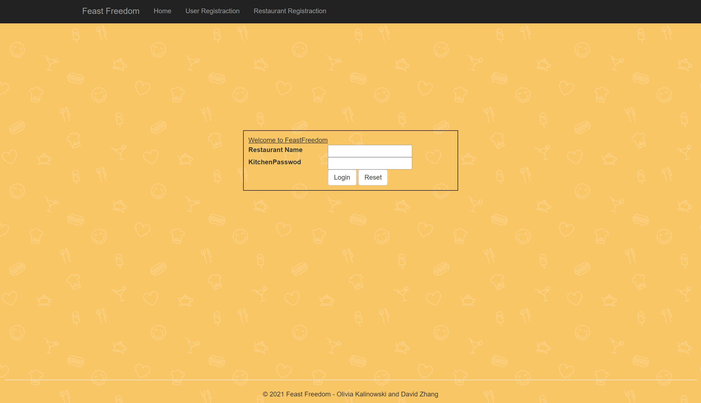

# FeastFreedom

FeastFreedom is a food service site for where restaurants upload menu items and users can order food off local menus. 
Users and Restaurants need to register and log in to use FeastFreedom services.

Unfortunately, website only exists on localhost for right now. 
After a restaurant registers, they are able to add multiple menu items to their menu.

When a restaurant log into their account, 
they are able to view their menu, add more items to their menu, as well as delete items from their menu.

After a user registers, they are informed of a successful registration and brought to the login page. 
Once the user logs in, they are able to view all the restaurants provided. When they click on the menu,
they are able to see the restuarant's menu as well as add menu items to their cart. 
When they finish their order, they click on the click to take them to their order page. 

After an order is placed an email is sent to both user and restaurant.

## Future Development
<ul>
<li>Allow Restaurants to edit their menu items</li>
<li>Add Paypal payment option</li>
<li>Make emails include orders information such as quantities, menu items, price total </li>
<li>Fix any lingering bugs</li>
</ul>

### Credits
Olivia Kalinowski and David Zhang